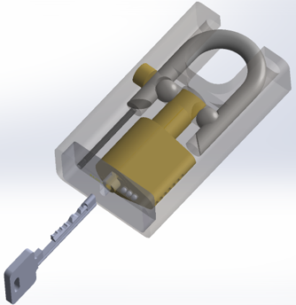
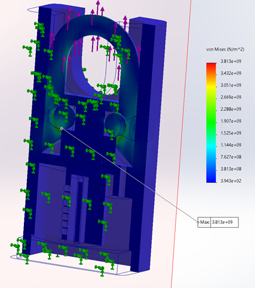

# High-Security Padlock Design (EN 12320 Grade 5)

**Project Status:** Completed (Academic Design & Analysis)
**Tools Used:** SolidWorks

*(Final assembly render of the modified Bowley-style padlock)*

*(Animation of padlock mechanism)*

## Abstract
This project involves the design and analysis of a high-security padlock engineered to meet **EN 12320 Grade 5** standards. The design replaces conventional brass bodies with **AISI 304 Steel** and incorporates **Hardened Boron Steel** for the shackle (UTS > 1600 MPa). 

The primary innovation is a modified Bowley-style locking mechanism that shields pin access, rendering traditional lockpicking tools (raking/single-pin picking) ineffective.

## Technical Specifications

| Feature | Specification |
| :--- | :--- |
| **Shackle Material** | Hardened 1.5510 Boron Steel (UTS ≥ 1600 MPa) |
| **Body Material** | AISI 304 Stainless Steel (Machined) |
| **Locking Mechanism** | 7-Pin Modified Bowley System (Shielded Keyway) |
| **Anti-Drill** | Embedded 52100 Chrome Steel Bearings |
| **Key Differs** | > 16,000 combinations ($4^7$) |
| **Est. Production** | CNC Milling & Turning (ISO 286 Grade 8 Tolerances) |

## Engineering Analysis (FEA)

### 1. Shackle Tensile & Torsion Test
Finite Element Analysis verified the shackle withstands cutting forces exceeding **70 kN**.
*   **Calculated Shear Strength:** ~720 MPa
*   **Full-Section Shear Resistance:** ~226.2 kN (Safety Factor > 3.0 against Grade 5 requirements)

### 2. Mechanism Stress Analysis
Simulations on the internal locking pins confirm resistance to **10 kN** pulling force and **20 Nm** torque, ensuring the mechanism does not shear under forced entry attempts.

## ⚙️ Design for Manufacturing (DFM)
*   **Machining vs. Casting:** Selected CNC machining for the steel body to ensure tighter tolerances (10 microns) required for the shielded keyway mechanism.
*   **Assembly:** Optimized for manual assembly with a "stacking" design, utilizing clearance fits for internal components and limited press-fits for sealing, reducing the need for complex adhesives or welding.

## 📂 Project Files
*   [Full Engineering Report (PDF)](./Documents/High_Security_Padlock_Report.pdf)
*   [CAD](./CAD+Manufacturing/) [Drawing](./Documents/Padlock%20Assembly.pdf)

---
*Created by Samuel Leung for MECH2520 Final Project*
